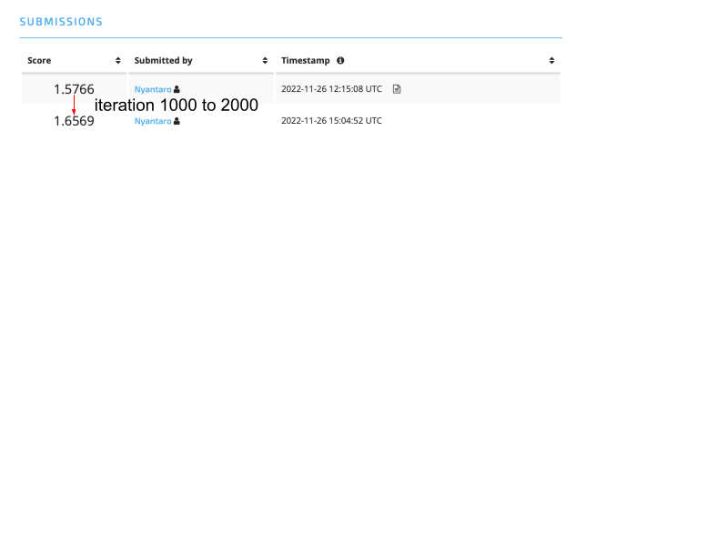
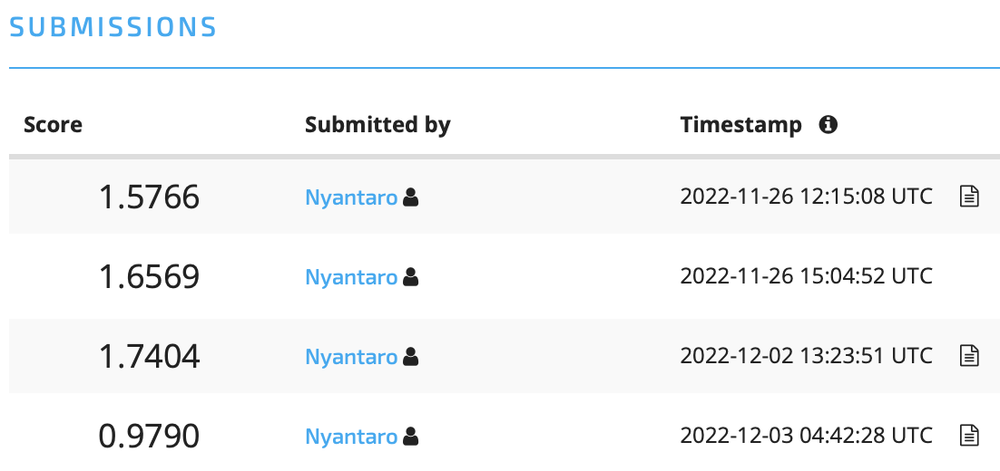
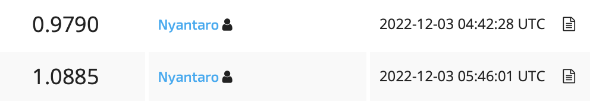

# dd_education

It is repository for below competition

https://www.drivendata.org/competitions/46/box-plots-for-education-reboot/submissions/

# Discussion
## Bench mark 1 gitHub

https://github.com/drivendataorg/box-plots-for-education/tree/5e450ff19739617c68f0a2c5e6b96c08a53c149a/1st-place

### Point
1. Not use Text_3 and Sub_Object_Description
2. Online learning 
3. Replacing , and “” to space

## Bench mark 2 gitHub

https://github.com/drivendataorg/box-plots-for-education/tree/5e450ff19739617c68f0a2c5e6b96c08a53c149a/2nd-place

### Point
1. combination of Log model and RF model

Log model: Stocastic Gradient Descent

RF model: Random forest model

2. FTE and Total were removed
NFL problem > ML problem

Why: 
1. a lot of NeN values
2. did not bring any usefulness to the model
## Bench mark 3 gitHub
https://github.com/drivendataorg/box-plots-for-education/blob/5e450ff19739617c68f0a2c5e6b96c08a53c149a/3rd-place/code/train1.R

### Point
1. It wrote by using R (I can't use the language)
2. GBM model
3. repeated text was converted to a number (top1 to 3)

## Score
First, I added predicted class to feature cols for next predict

change iteration 1000 -> 2000

It may be case of over fitting

1. Delete Text_3 and Sub_Object_Description
2. Not add predicted class to feature cols

-> 0.9790

Why: predicted class may case of low score

1. Delete four columns (Text_3, Sub_Object_Description, FTE and Total)

0.9790 -> 1.0885

        
